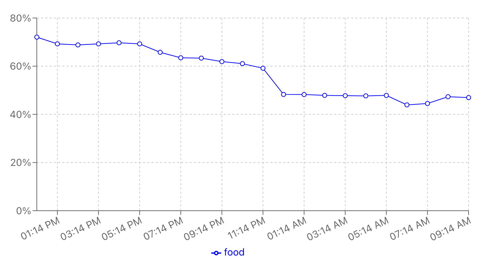

# Cat-Feeder-Data-Visualizer

Uses React to display data charts of my other project, the Computer Vision Cat Feeder.
The backend is built in Node.js and Express.js and fetches data from the Raspberry Pi.
It then stores that data in a MongoDB database where the average of every hour can be sent out as needed.
The React frontend fetches from the backend and graphs the samples taken.

## How to install
-todo-

## How it works
-todo-

## How to setup
-todo-